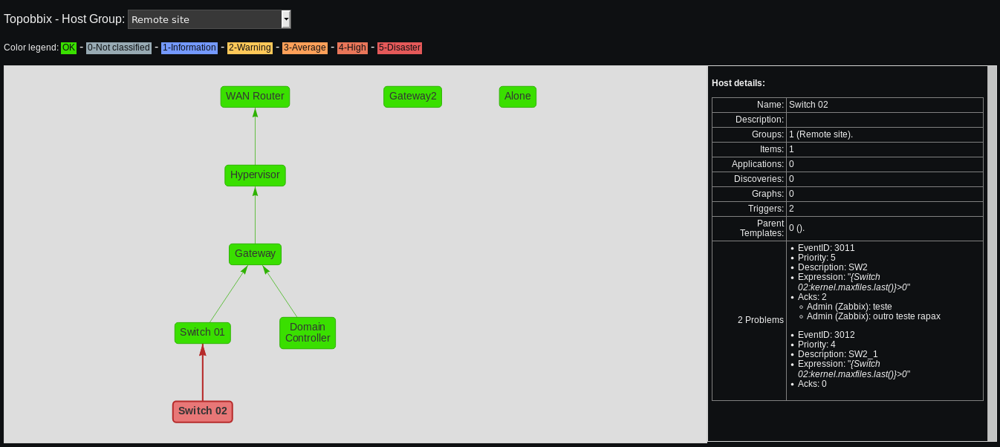
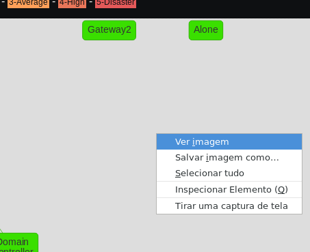
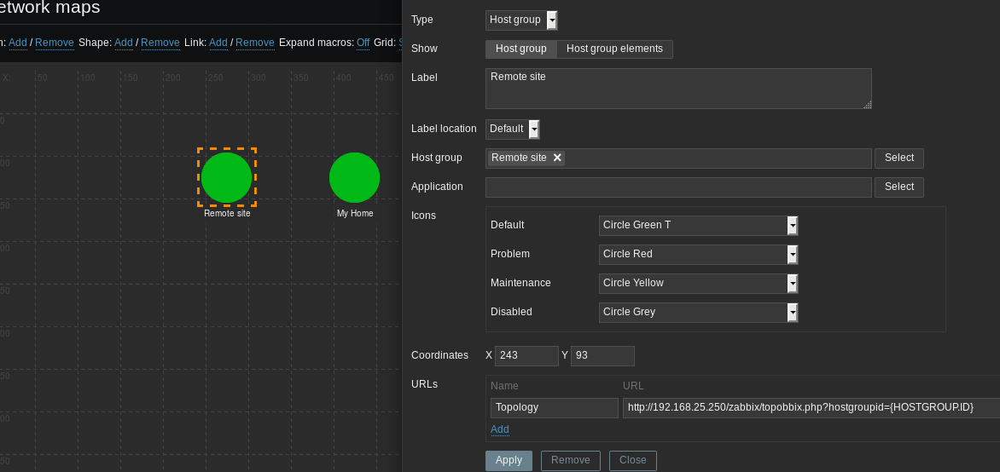

# Topobbix

Topobbix generates a network topology based on the dependencies between the triggers of a given host group.

## Getting Started

These instructions will enable you to use the PHP script in your Zabbix environment.

### Prerequisites

Currently the script works only in Zabbix environments that use the MySQL/MariaDB or PostgreSQL database.

Tested in Zabbix 3.4.

### Installing

[Download Topobbix](https://github.com/thiagomdiniz/zabbix/releases/download/v1.0/topobbix_v1.0.zip) to the document root of your Zabbix frontend and unzip file.
For example, if you use CentOS 7, the document root directory is located in "/usr/share/zabbix".

### Usage

Topobbix respects the permissions of hostgroups configured in Zabbix. You must be logged in to the Zabbix frontend so that you can select hostgroups in Topobbix. In case you are not logged in, Topobbix will notify you.

The PHP script accepts two url parameters:
* "hostgroup": Optional. Defines which hostgroup name in your Zabbix environment will be queried.
* "vhostid": Optional. If the value is a Zabbix Host ID, the host is automatically selected in the topology.

With the Topobbix scripts unziped to the document root of your Zabbix Frontend, access it through the URL of your Zabbix:
* "https://localhost/zabbix/topobbix.php"
Select a host group and the topology will appear in the browser:

The colors of the triggers' severities are acquired from the Zabbix configuration. When any topology host contains active problems, its color will be changed to the most severe among active issues.

When you click on a host, its details are displayed next to the topology.

The vis.js library allows you to zoom in and out on the topology.

Vis.js library allows you to right-click the topology and save it as an image:

You can also use URLs on Zabbix maps with the {HOSTGROUP.ID} macro:

## Built With

* [PHP](http://php.net/) - PHP is a popular general-purpose scripting language that is especially suited to web development.
* [vis.js](http://visjs.org/) - A dynamic, browser based visualization library.
* [JQuery](https://jquery.com/) - The Write Less, Do More, JavaScript Library.

## Authors

* **Thiago Diniz** - [LinkedIn](https://www.linkedin.com/in/thiagomdiniz/)
